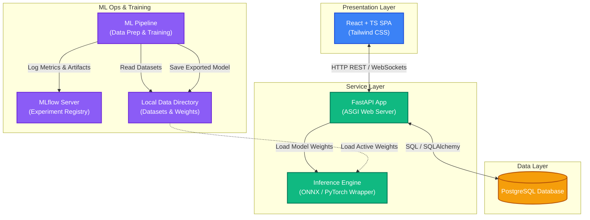
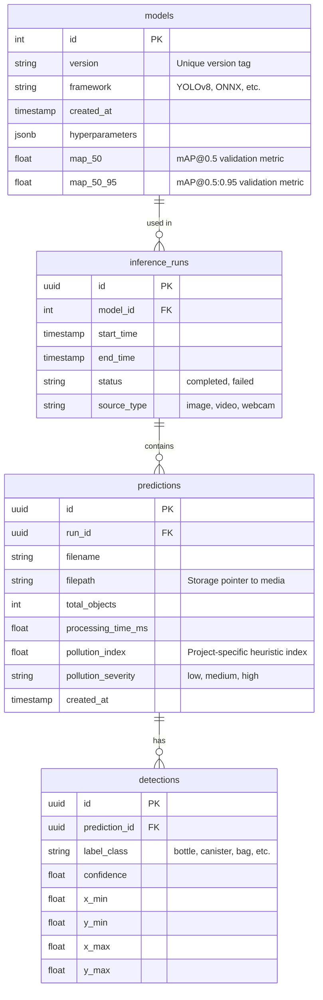
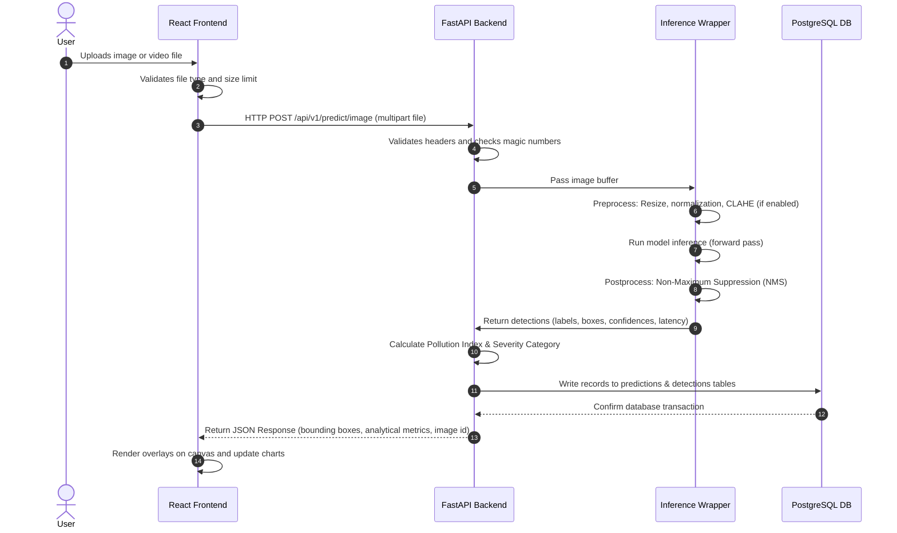

# System Architecture: AquaGuard AI

This document details the architectural layout, component relationships, data flow, and database schema for the AquaGuard AI platform.

---

## 1. System Architecture Overview

AquaGuard AI is designed as a modular **monorepo** dividing the frontend presentation, backend REST API, database storage, and machine learning pipeline into decoupled layers.

---

## 2. Logical Components

### 2.1 Frontend Tier (React, TypeScript, Tailwind CSS)
- **Role:** Interactive UI dashboard.
- **Key Modules:**
  - **Uploader Component:** Handles drag-and-drop file ingestion, file validation (mime-type, size), and upload progress.
  - **Interactive Canvas Component:** Renders the input image or video with custom SVG overlay overlays for bounding boxes, class labels, and confidence metrics.
  - **Analytics Panel:** Renders historical trends using a charting library (e.g., Recharts) showing debris counts, classification distributions, and active pollution index trends.
  - **Configuration Section:** Allows users to dynamically update inference parameters (e.g., confidence threshold, NMS threshold) sent to the API.

### 2.2 Backend Tier (FastAPI, Uvicorn)
- **Role:** High-performance REST API hosting business logic, database transaction orchestration, and inference wrapper.
- **Key Modules:**
  - **Controllers (Routes):** Clean routing definitions with strict Pydantic inputs/outputs.
  - **Services:** Decoupled business logic (e.g., calculation of the Pollution Index, metadata processing).
  - **Inference Wrapper:** Manages model lifetime, loads model files dynamically, performs preprocessing steps, executes forward passes, and handles postprocessing (Non-Maximum Suppression).
  - **Database Manager (SQLAlchemy):** Handles connection pools, sessions, and CRUD operations.

### 2.3 Database Tier (PostgreSQL)
- **Role:** Persistent storage.
- **Schema Design:**
  - Designed to track predictions, individual bounding box detections, loaded model versions, and general processing statistics.

### 2.4 ML Tier (Python Pipeline)
- **Role:** Independent training environment, disconnected from the serving runtime.
- **Key Modules:**
  - **Dataset Auditor:** Standalone auditing scripts verifying data integrity.
  - **Trainer:** Scripts to train classifiers and object detectors.
  - **Exporter:** Converts raw models (e.g., `.pt` files) into lightweight `.onnx` runtimes optimized for CPU execution.

---

## 3. Database Schema

The conceptual PostgreSQL database structure is organized around four key entities:

---

## 4. End-to-End Data Flow

The flow of data through the system from an uploaded image to visualization is detailed below:

---

## 5. Security & Operational Boundary

- **Inference Sandbox:** The inference layer handles only raw numerical arrays in-memory. Under no circumstances will the system dynamically execute code embedded in models or upload packages (e.g., using safe weights loading strategies like YAML loading blocks or avoiding pickle where possible by using ONNX).
- **Network Boundaries:** Frontend communicates strictly via HTTP/HTTPS/WebSockets. Database ports are kept internal to the Docker environment and not exposed to the public internet.
- **Resource Protection:** Enforce video processing rate-limiting or synchronous queues to prevent CPU/GPU memory exhaustion by concurrently processing multiple large video uploads.
